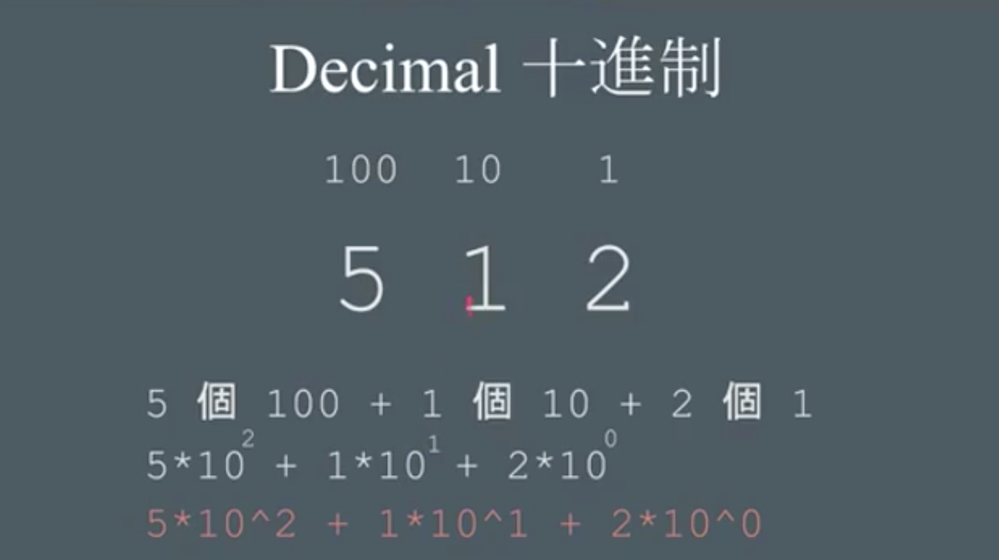

week0 overview


# 二進位制

電腦的最底層都是一堆0和1的電子訊號組成

# 十進位制 Decimal

# 次方

``` ^ ```

## 十進位的次方表示法



## 二進位的次方表示法

``` 
101 = 1^4 + 0^2 + 1^1 = 5

```

十進位換算二進位


## 八進制 Octal


## 十六進制


# ASCII code

可以用數字（數字）表示一個文字

72 73 33 可以表示 HI! 也可以表示RGB （Red green Blue）(0-255 256個level)

RGB 也可用16進位制表示：


# Algorithem

## loop: go back to step 1 

## condition（if/else表示式） + loop（迴圈） + Booleen expression(布林表示式): Binary search 二分搜尋法 二分搜


## 速度表示圖

log可以表示很大很大的數字


二的次方來成長是一件很可怕的事情

複利是一件很可怕的事情

次方減半來搜尋是非常快的事情

時間複雜度 time complicity O(n); O(log n)

每個作業平均花的時間


# Scratch

blocky也可以

scratch 要去看cs50

用scratch做一個遊戲。


